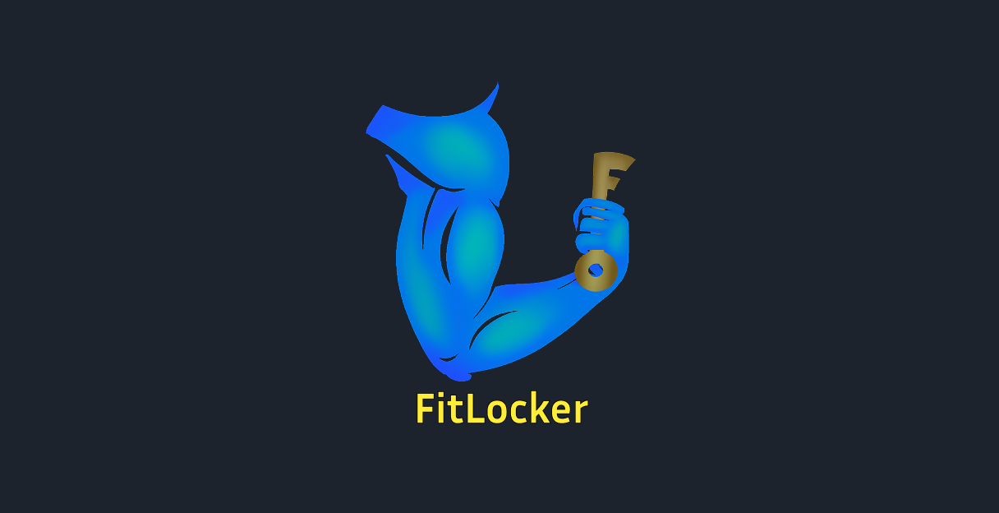

# Hi there, I'm Andrea! 👋

I am an **HCI Researcher** currently working within the [**e-lite research group**](https://e-lite.polito.it/) at DAUIN (Department of Control and Computer Engineering) at Politecnico di Torino, Italy. I hold a Master’s degree in **Cinema and Media Engineering**, a background that allows me to combine UX design and front-end development with a unique perspective on media interaction.

My goal is to study user interaction to promote more conscious, ethical, and user-centered digital environments.

---

## 🔬 Research Interests
- **Human-Computer Interaction (HCI) & UX Research**
- **Digital Wellbeing & Attention Economy**
- **Deceptive Designs**

---

## 💼 Projects

<table border="0">
  <tr>
    <td width="33%"></td>
    <td width="33%"></td>
    <td width="33%"></td>
  </tr>
  
  <tr valign="middle">
    <td>
      <h3> TikTok Research Panel</h3>
      <b><ins>Chrome Extension</ins></b> for experimental HCI research. Study on how digital design patterns impact user agency through UI modification.
        
    </td>
    <td>
      <h3>📦 FitLocker</h3>
      <b><ins>Android Application</ins></b> in Kotlin featuring a custom locker system. End-to-end flow designed for seamless delivery management.
        
    </td>
    <td>
      <h3>🎨 MUSA</h3>
      <b><ins>Android Application</ins></b> in Kotlin designed through a full UX cycle to help artists overcome creative blocks via tailored exercises.
        
    </td>
  </tr>
  
  <tr valign="middle">
    <td style="border-top: 1px solid #444; padding-top: 12px;">
      <a href="https://git.elite.polito.it/public-projects/tiktok_agency"><b>Code Repo 💻</b></a> &nbsp;|&nbsp; 
      <a href="https://webthesis.biblio.polito.it/id/eprint/37761"><b>Thesis PDF 📄</b></a>
    </td>
    <td style="border-top: 1px solid #444; padding-top: 12px;">
      <a href="https://github.com/andredelu98/FitLocker"><b>Code Repo 💻</b></a>
    </td>
    <td style="border-top: 1px solid #444; padding-top: 12px;">
      <a href="https://github.com/polito-uxd-2023/Musa"><b>Code Repo 💻</b></a>
    </td>
  </tr>
</table>

---

## 🛠️ Tech Stack & Tools

        

---

  
<h2>📂 Other Projects</h2>

  ### 🎮 Game Development
  *Unity projects where I primarily contributed as a 3D Artist, Art Director, and Project Manager, with additional support in C# programming.*

  - **[Virtual Epidemic](https://github.com/ProgettoGameDesign/Virtual-Epidemic)** | [Pitch Deck 📄](LINK_TO_YOUR_PDF)
    A 3D puzzle game with a top-down view about saving a university from a virtual epidemic[cite: 4].
  - **[Elemhands](https://c-est-la-v.itch.io/elemhands)** | [Itch.io 🕹️](https://c-est-la-v.itch.io/elemhands)
    A VR puzzle game for Meta Quest 2 and 3 where players master elemental powers.
  - **[RipHit](https://andredelu98.itch.io/riphit)** | [Itch.io 🕹️](https://andredelu98.itch.io/riphit)
    A fighting game and visual novel about facing off against the Grim Reaper.

---

## 📫 Let's Connect
- [**LinkedIn**](https://www.linkedin.com/in/andredelu/)
- **Email:** [andrea_deluca@polito.it]
